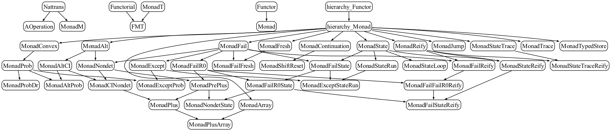

<!---
This file was generated from `meta.yml`, please do not edit manually.
Follow the instructions on https://github.com/coq-community/templates to regenerate.
--->
# Monadic effects and equational reasoning in Coq

[![Docker CI][docker-action-shield]][docker-action-link]

[docker-action-shield]: https://github.com/affeldt-aist/monae/workflows/Docker%20CI/badge.svg?branch=master
[docker-action-link]: https://github.com/affeldt-aist/monae/actions?query=workflow:"Docker%20CI"


This Coq library contains a hierarchy of monads with their laws used
in several examples of monadic equational reasoning.

## Meta

- Author(s):
  - Reynald Affeldt (initial)
  - David Nowak (initial)
  - Takafumi Saikawa (initial)
  - Jacques Garrigue
  - Celestine Sauvage
  - Kazunari Tanaka
- License: [LGPL-2.1-or-later](LICENSE)
- Compatible Coq versions: Coq 8.13
- Additional dependencies:
  - [MathComp ssreflect](https://math-comp.github.io)
  - [MathComp fingroup](https://math-comp.github.io)
  - [MathComp algebra](https://math-comp.github.io)
  - [MathComp solvable](https://math-comp.github.io)
  - [MathComp field](https://math-comp.github.io)
  - [MathComp analysis](https://github.com/math-comp/analysis)
  - [Infotheo](https://github.com/affeldt-aist/infotheo)
  - [Paramcoq](https://github.com/coq-community/paramcoq)
- Coq namespace: `monae`
- Related publication(s):
  - [A hierarchy of monadic effects for program verification using equational reasoning](https://staff.aist.go.jp/reynald.affeldt/documents/monae.pdf) doi:[10.1007/978-3-030-33636-3_9](https://doi.org/10.1007/978-3-030-33636-3_9)
  - [A Trustful Monad for Axiomatic Reasoning with Probability and Nondeterminism](https://arxiv.org/abs/2003.09993) 
  - [Extending Equational Monadic Reasoning with Monad Transformers](https://arxiv.org/abs/2011.03463) 

## Building and installation instructions

The easiest way to install the latest released version of Monadic effects and equational reasoning in Coq
is via [OPAM](https://opam.ocaml.org/doc/Install.html):

```shell
opam repo add coq-released https://coq.inria.fr/opam/released
opam install coq-monae
```

To instead build and install manually (with GNU `make`), do:
``` shell
git clone https://github.com/affeldt-aist/monae.git
cd monae
make -j 4
make sect5
make -C impredicative_set
make install
```

## Overview

This repository contains a formalization of monads including examples
of monadic equational reasoning and several models (in particular, a
model for a monad that mixes non-deterministic choice and
probabilistic choice). This corresponds roughly to the formalization
of the following papers:
- [Gibbons and Hinze, Just do It: Simple Monadic Equational Reasoning, ICFP 2011] (except Sect. 10.2)
- [Gibbons, Unifying Theories of Programming with Monads, UTP 2012] (up to Sect. 7.2)
- [Mu, Equational Reasoning for Non-determinism Monad: A Case study of Spark Aggregation, TR-IIS-19-002, Academia Sinica]
- [Mu, Calculating a Backtracking Algorithm: An exercise in Monadic Program Derivation, TR-IIS-29-003, Academia Sinica]
- [Mu, Functional Pearls: Reasoning and Derivation of Monadic Programs, A case study of non-determinism and state, 2017]
  + This is a draft paper. In the first release, we formalized this draft up to Sect. 5.
    The contents have been since superseded by [mu2019tr2] and [mu2019tr3].

This library has been applied to other formalizations:
- application to program semantics (see file `smallstep.v`)
- formalization of monad composition [Jones and Duponcheel, Composing Monads, Yale RR 1993] (Sections 2 and 3)
- formalization of monad transformers [Jaskelioff, Modular Monad Transformers, ESOP 2009] (up to Sect. 4)
  + completed with details from [Jaskelioff, Lifting of Operations in Modular Monadic Semantics, PhD 2009]
  + see directory `impredicative_set` for the formalization of [Jaskelioff, Modular Monad Transformers, ESOP 2009] (from Sect. 5)
- formalization of the geometrically convex monad (main reference:
  [Cheung, Distributive Interaction of Algebraic Effects, PhD Thesis, U. Oxford, 2017])



## Files

- [monae_lib.v](./monae_lib.v): simple additions to base libraries
- [hierarchy.v](./hierarchy.v): hierarchy of monadic effects
- [monad_lib.v](./monad_lib.v): basic lemmas about monads
- [category.v](./category.v): formalization of categories (generalization of ~hierarchy.v~)
- [fail_lib.v](./fail_lib.v): lemmas about fail monad and related monads
- [state_lib.v](./state_lib.v): lemmas about state-related monads
- [trace_lib.v](./trace_lib.v): lemmas about about the state-trace monad
- [proba_lib.v](./proba_lib.v): about the probability monad
- [monad_composition.v](./monad_composition.v): composing monads
- [monad_transformer.v](./monad_transformer.v): monad transformers
  + completed by `ifmt_lifting.v` and `iparametricty_codensity.v` in the directory `impredicative_set`
    * the directory `impredicative_set` contains a lighter version of Monae where monads live in `Set` and that compiles with `impredicate-set`
- [monad_model.v](./monad_model.v): concrete models of monads (up to state and trace monads)
- [proba_monad_model.v](./proba_monad_model.v): concrete model of the probability monad
- [gcm_model.v](./gcm_model.v): model of the geometrically convex monad
- [altprob_model.v](./altprob_model.v): model of a monad that mixes non-deterministic choice and probabilistic choice
- example_*.v: various examples (Spark aggregation, the n-queens puzzle, tree relabeling,  Monty Hall problem, monad transformers, etc.)
- [smallstep.v](./smallstep.v): semantics for an imperative language, with equivalence operational semantics/denotation and sample imperative programs

## About Installation with Windows 10

Installation of monae on Windows is less simple.
First install infotheo following the [instructions for Windows 10](https://github.com/affeldt-aist/infotheo).
Once infotheo is installed:
1. If opam is available, do
   + `opam install coq-monae` or `git clone git@github.com:affeldt-aist/monae.git; opam install .`
2. If opam is not available (i.e., installation of MathComp using unzip, untar, cd, make, make install),
   do:
   + `git clone git@github.com:affeldt-aist/monae.git`
   + `coq_makefile -o Makefile -f _CoqProject`
   + `make`

## Original License

Before version 0.2, monae was distributed under the terms of the `GPL-3.0-or-later` license
