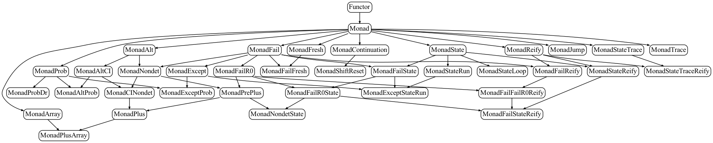

<!---
This file was generated from `meta.yml`, please do not edit manually.
Follow the instructions on https://github.com/coq-community/templates to regenerate.
--->
# Monadic effects and equational reasoning in Rocq

[![Docker CI][docker-action-shield]][docker-action-link]

[docker-action-shield]: https://github.com/affeldt-aist/monae/actions/workflows/docker-action.yml/badge.svg?branch=master
[docker-action-link]: https://github.com/affeldt-aist/monae/actions/workflows/docker-action.yml


This Coq library contains a hierarchy of monads with their laws used
in several examples of monadic equational reasoning.

## Meta

- Author(s):
  - Reynald Affeldt (initial)
  - David Nowak (initial)
  - Takafumi Saikawa (initial)
  - Jacques Garrigue
  - Ayumu Saito
  - Celestine Sauvage
  - Kazunari Tanaka
- License: [LGPL-2.1-or-later](LICENSE)
- Compatible Coq versions: Coq 8.19-8.20
- Additional dependencies:
  - [MathComp ssreflect](https://math-comp.github.io)
  - [MathComp fingroup](https://math-comp.github.io)
  - [MathComp algebra](https://math-comp.github.io)
  - [MathComp solvable](https://math-comp.github.io)
  - [MathComp field](https://math-comp.github.io)
  - [MathComp analysis](https://github.com/math-comp/analysis)
  - [Infotheo](https://github.com/affeldt-aist/infotheo)
  - [Paramcoq](https://github.com/coq-community/paramcoq)
  - [Hierarchy Builder](https://github.com/math-comp/hierarchy-builder)
  - [Coq-Equations](https://github.com/mattam82/Coq-Equations)
- Coq namespace: `monae`
- Related publication(s):
  - [A hierarchy of monadic effects for program verification using equational reasoning](https://staff.aist.go.jp/reynald.affeldt/documents/monae.pdf) doi:[10.1007/978-3-030-33636-3_9](https://doi.org/10.1007/978-3-030-33636-3_9)
  - [Extending Equational Monadic Reasoning with Monad Transformers](https://drops.dagstuhl.de/opus/volltexte/2021/13881/) doi:[10.4230/LIPIcs.TYPES.2020.2](https://doi.org/10.4230/LIPIcs.TYPES.2020.2)
  - [A Trustful Monad for Axiomatic Reasoning with Probability and Nondeterminism](https://arxiv.org/abs/2003.09993) doi:[10.1017/S0956796821000137](https://doi.org/10.1017/S0956796821000137)
  - [Towards a practical library for monadic equational reasoning in Coq](https://staff.aist.go.jp/reynald.affeldt/documents/monae-mpc2022.pdf) doi:[10.1007/978-3-031-16912-0_6](https://doi.org/10.1007/978-3-031-16912-0_6)
  - [Environment-friendly monadic equational reasoning for OCaml](https://coq-workshop.gitlab.io/2023/abstracts/coq2023_monadic-reasoning.pdf) 
  - [A practical formalization of monadic equational reasoning in dependent-type theory](https://www.cambridge.org/core/services/aop-cambridge-core/content/view/B59B87DE000F48B9807F24AEDB11452E/S0956796824000157a.pdf/a-practical-formalization-of-monadic-equational-reasoning-in-dependent-type-theory.pdf) doi:[10.1017/S0956796824000157](https://doi.org/10.1017/S0956796824000157)

## Building and installation instructions

The easiest way to install the latest released version of Monadic effects and equational reasoning in Rocq
is via [OPAM](https://opam.ocaml.org/doc/Install.html):

```shell
opam repo add coq-released https://coq.inria.fr/opam/released
opam install coq-monae
```

It installs two directories in `coq/user-contrib`: `monae` and
`monaeImpredicativeSet`.

To instead build and install manually (with GNU `make`), do:
``` shell
git clone https://github.com/affeldt-aist/monae.git
cd monae
make -j 4
make install
```

## Overview

This repository contains a formalization of monads including examples
of monadic equational reasoning and several models. This includes for
example the formalization of the following papers:
- [Gibbons and Hinze, Just do It: Simple Monadic Equational Reasoning, ICFP 2011] (except Sect. 10.2)
- [Gibbons, Unifying Theories of Programming with Monads, UTP 2012] (up to Sect. 7.2)
- [Mu, Equational Reasoning for Non-determinism Monad: A Case study of Spark Aggregation, TR-IIS-19-002, Academia Sinica]
- [Mu, Calculating a Backtracking Algorithm: An exercise in Monadic Program Derivation, TR-IIS-29-003, Academia Sinica]
- [Mu, Functional Pearls: Reasoning and Derivation of Monadic Programs, A case study of non-determinism and state, 2017]
  + This is a draft paper. In the first release, we formalized this draft up to Sect. 5.
    The contents have been since superseded by [mu2019tr2] and [mu2019tr3].
- [Mu and Chiang, Deriving Monadic Quicksort (Declarative Pearl), 2020]

This library has been applied to other formalizations:
- application to program semantics (see file `smallstep.v`)
- formalization of monad composition [Jones and Duponcheel, Composing Monads, Yale RR 1993] (Sections 2 and 3)
- formalization of monad transformers [Jaskelioff, Modular Monad Transformers, ESOP 2009] (up to Sect. 4)
  + completed with details from [Jaskelioff, Lifting of Operations in Modular Monadic Semantics, PhD 2009]
  + see directory `impredicative_set` for the formalization of [Jaskelioff, Modular Monad Transformers, ESOP 2009] (from Sect. 5)
- formalization of the geometrically convex monad (main reference:
  [Cheung, Distributive Interaction of Algebraic Effects, PhD Thesis, U. Oxford, 2017])



## Files

- core:
  + [preamble.v](./theories/core/preamble.v): simple additions to base libraries
  + [hierarchy.v](./theories/core/hierarchy.v): hierarchy of monadic effects
  + [category.v](./theories/core/category.v): formalization of concrete categories (generalization of the bottom layers of `hierarchy.v`)
  + [monad_transformer.v](./theories/core/monad_transformer.v): monad transformers
    * completed by `ifmt_lifting.v` and `iparametricity_codensity.v` in the directory `impredicative_set`
      - the directory `impredicative_set` contains a lighter version of Monae where monads live in `Set` and that compiles with the `impredicative-set` option of Rocq
- libraries for each monad theory:  
  + [monad_lib.v](./theories/lib/monad_lib.v): basic lemmas about monads
  + [alt_lib.v](./theories/lib/alt_lib.v): lemmas about the nondeterminism monad
  + [fail_lib.v](./theories/lib/fail_lib.v): lemmas about the fail monad and related monads
  + [state_lib.v](./theories/lib/state_lib.v): lemmas about state-related monads
  + [array_lib.v](./theories/lib/array_lib.v): lemmas about the array monad
  + [trace_lib.v](./theories/lib/trace_lib.v): lemmas about about the state-trace monad
  + [proba_lib.v](./theories/lib/proba_lib.v): lemmas about the probability monad
  + [typed_store_lib.v](./theories/lib/typed_store_lib.v): derived definitions and lemmas about about the typed store monad
- models of monads:
  + [monad_model.v](./theories/models/monad_model.v): concrete models of monads
  + [proba_monad_model.v](./theories/models//proba_monad_model.v): model of the probability monad
  + [gcm_model.v](./theories/models//gcm_model.v): model of the geometrically convex monad
  + [altprob_model.v](./theories/models//altprob_model.v): model of a monad that mixes non-deterministic choice and probabilistic choice
  + [typed_store_model.v](./theories/models//typed_store_model.v): alternative model of the typed store monad
- applications:
  + [example_relabeling.v](./theories/applications/example_relabeling.v): tree relabeling
  + [example_monty.v](./theories/applications/example_monty.v): Monty Hall problem
  + [example_spark.v](./theories/applications/example_spark.v): Spark aggregation
  + [example_iquicksort.v](./theories/applications/example_iquicksort.v): in-place quicksort
  + [example_quicksort.v](./theories/applications/example_quicksort.v): functional quicksort
  + [example_nqueens.v](./theories/applications/example_nqueens.v): the n-queens puzzle
  + [example_typed_store.v](./theories/applications/example_typed_store.v): ML programs with references
  + [example_transformer.v](./theories/applications/example_transformer.v): monad transformers
  + [smallstep.v](./theories/applications/smallstep.v): semantics for an imperative language, with equivalence operational semantics/denotation and sample imperative programs
  + [monad_composition.v](./theories/applications/monad_composition.v): composing monads
  + [category_ext.v](./theories/applications/category_ext.v): experimental library about categories

## About Installation with Windows 11

Installation of monae on Windows is less simple.
First install infotheo following the [instructions for Windows 11](https://github.com/affeldt-aist/infotheo).
Once infotheo is installed (with opam), do:
- `opam install coq-monae` or `git clone git@github.com:affeldt-aist/monae.git; opam install .`

## Original License

Before version 0.2, monae was distributed under the terms of the `GPL-3.0-or-later` license
